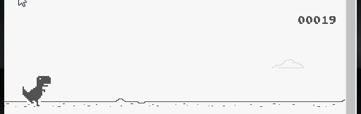

# Recriando o famoso jogo do dinossauro sem internet

- Neste projeto o desafio era criar uma cópia do jogo do dinossauro, para entreter quando estamos sem conexão.
- Tecnologias  utilizadas HTML, CSS E JS.
-  Conteúdo aprendido durante o desenvolvimento foi manipulação de eventos, funções e DOM.
Estilização e animações com CSS
   

  

